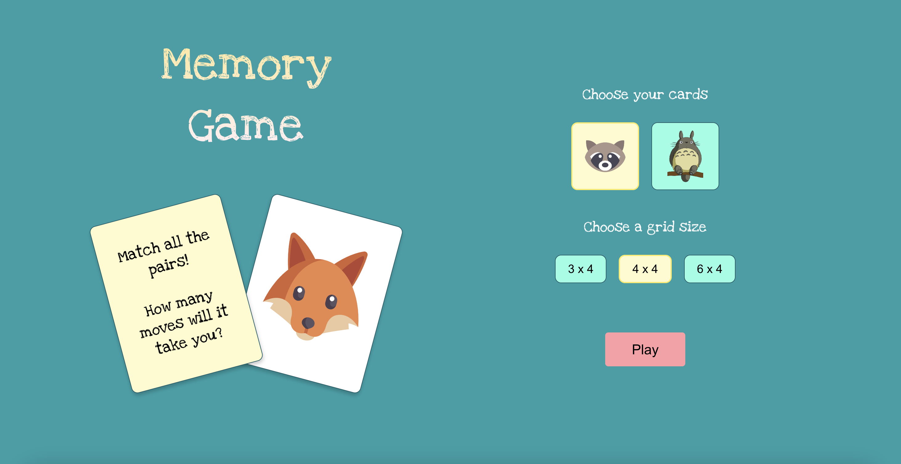
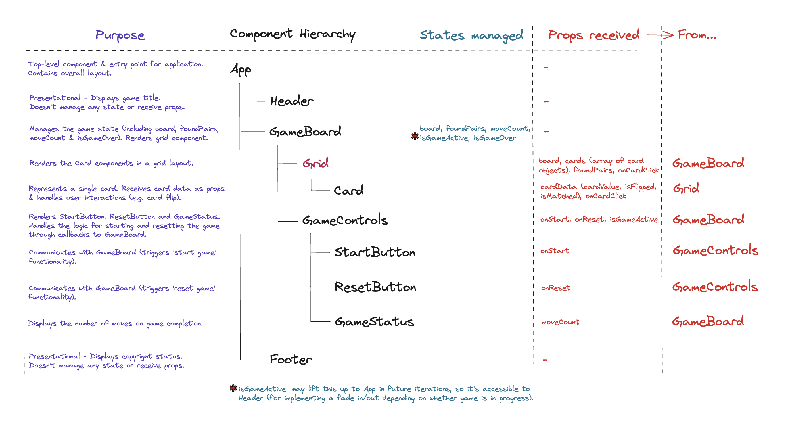

# Memory Game React App

This project is a React adaptation of a memory card game originally created as a Python CLI application.  
You can play it [here](https://memory-pairs-game.pages.dev/).   

## Project Status
This app is a work in progress and part of my learning journey in React development. While fully functional, it may have some visual inconsistencies across different screen sizes and occasional quirks in modal positioning. I've been working on improving these aspects and welcome any feedback or suggestions!

## Development Process

The journey from concept to execution involves a series of carefully planned steps, each aimed at delivering a robust and user-friendly application.

### Planning and Design

- **Transition from Python CLI to React**: Leveraging the core logic from the Python CLI version to build an interactive web version using React.
- **User Stories**: Defined the application's expected responses to user actions, forming the basis for feature development.
- **UI Design**: Drafted and refined the user interface design in Figma, with a focus on accessibility and visual appeal.
- **Testing Strategy**: Outlined a strategy for Jest/React Testing Library to conduct unit and integration tests.
- **Component Hierarchy and State Management**: Mapped out the structure and data flow between components, along with the management of state within the application.
- **Game Logic and User Interaction**: Analysed the transition of game logic from the Python application to fit a GUI context, considering the events and user actions that would trigger updates to state and UI.

### Diagramming and Visualisation

- **Component Hierarchy Diagram**: Illustrated the organisation of components and their relationships, providing a clear blueprint for the app structure.

- **Game Flow Diagram**: Developed a flow diagram to visualise the game logic, tying together user actions, state management, and UI updates. This served as an invaluable tool for planning and understanding the dynamics of the React application.

### Test-Driven Development (TDD)

- Utilised TDD, with a set of preliminary tests guiding the development of a minimum viable product (MVP).

# Getting Started with Create React App

This project was bootstrapped with [Create React App](https://github.com/facebook/create-react-app).

## Available Scripts

In the project directory, you can run:

### `npm start`

Runs the app in the development mode.\
Open [http://localhost:3000](http://localhost:3000) to view it in your browser.

The page will reload when you make changes.\
You may also see any lint errors in the console.

### `npm test`

Launches the test runner in the interactive watch mode.\
See the section about [running tests](https://facebook.github.io/create-react-app/docs/running-tests) for more information.

### `npm run test:repeated`

Executes the test suite multiple times (default 5) to catch intermittent issues.\
This non-interactive mode runs all tests and exits, providing a more robust check of test reliability.\
Ideal for use in CI/CD pipelines or before committing changes.

### `npm run build`

Builds the app for production to the `build` folder.\
It correctly bundles React in production mode and optimizes the build for the best performance.

The build is minified and the filenames include the hashes.\
Your app is ready to be deployed!

See the section about [deployment](https://facebook.github.io/create-react-app/docs/deployment) for more information.

### `npm run eject`

**Note: this is a one-way operation. Once you `eject`, you can't go back!**

If you aren't satisfied with the build tool and configuration choices, you can `eject` at any time. This command will remove the single build dependency from your project.

Instead, it will copy all the configuration files and the transitive dependencies (webpack, Babel, ESLint, etc) right into your project so you have full control over them. All of the commands except `eject` will still work, but they will point to the copied scripts so you can tweak them. At this point you're on your own.

You don't have to ever use `eject`. The curated feature set is suitable for small and middle deployments, and you shouldn't feel obligated to use this feature. However we understand that this tool wouldn't be useful if you couldn't customize it when you are ready for it.

## Learn More

You can learn more in the [Create React App documentation](https://facebook.github.io/create-react-app/docs/getting-started).

To learn React, check out the [React documentation](https://reactjs.org/).

### Code Splitting

This section has moved here: [https://facebook.github.io/create-react-app/docs/code-splitting](https://facebook.github.io/create-react-app/docs/code-splitting)

### Analyzing the Bundle Size

This section has moved here: [https://facebook.github.io/create-react-app/docs/analyzing-the-bundle-size](https://facebook.github.io/create-react-app/docs/analyzing-the-bundle-size)

### Making a Progressive Web App

This section has moved here: [https://facebook.github.io/create-react-app/docs/making-a-progressive-web-app](https://facebook.github.io/create-react-app/docs/making-a-progressive-web-app)

### Advanced Configuration

This section has moved here: [https://facebook.github.io/create-react-app/docs/advanced-configuration](https://facebook.github.io/create-react-app/docs/advanced-configuration)

### Deployment

This section has moved here: [https://facebook.github.io/create-react-app/docs/deployment](https://facebook.github.io/create-react-app/docs/deployment)

### `npm run build` fails to minify

This section has moved here: [https://facebook.github.io/create-react-app/docs/troubleshooting#npm-run-build-fails-to-minify](https://facebook.github.io/create-react-app/docs/troubleshooting#npm-run-build-fails-to-minify)
